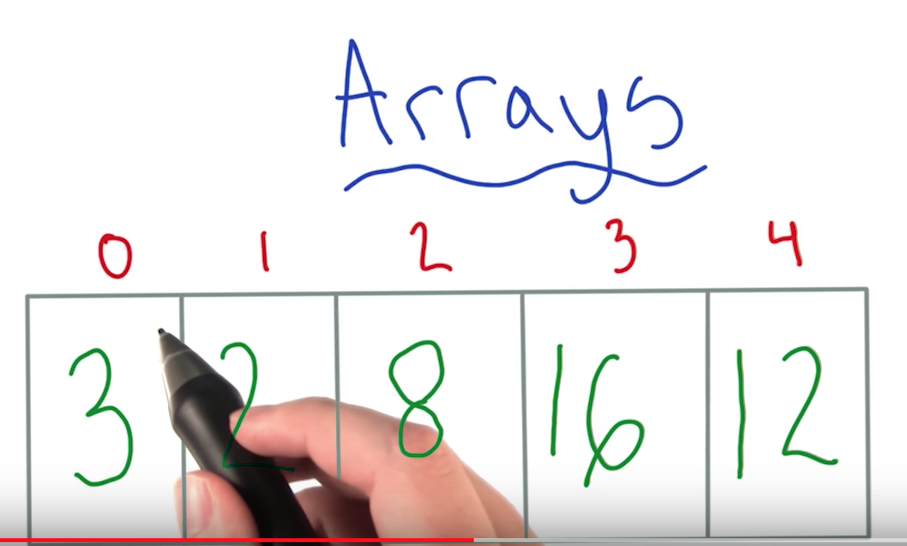
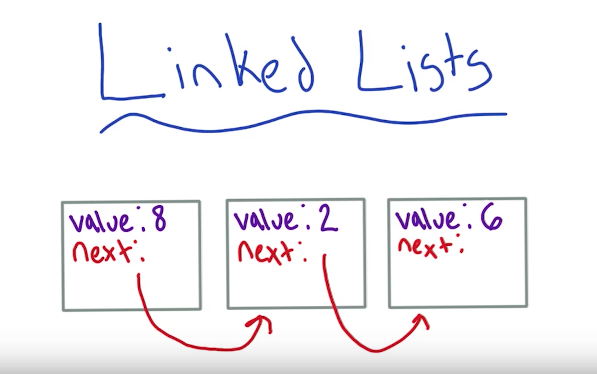
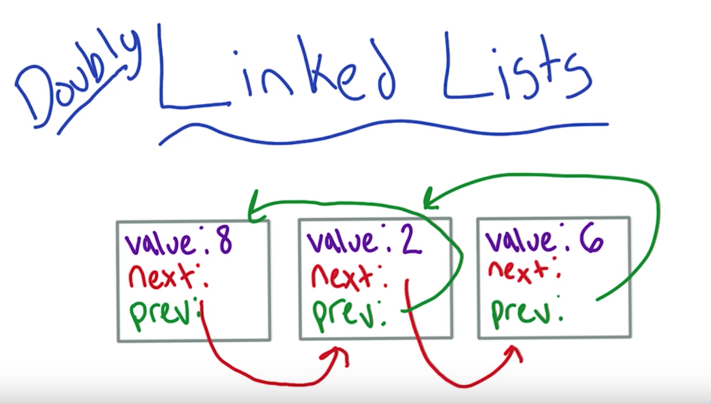

# Efficiency of code

* Time -> How much time does it take to run
* Space -> How much space does it take to run

## Big O Notation -> Describe Efficiency

* O ( Algebraic expression )
* Example: `O(n), O(log(n)), O(1) -- O(On + 1), O(n^2)`


* Example:

* ```python
function decode(input):
  create output string O(1)
  O(n*3)
  for each letters in input: O(1)
    get new_letter from letter location in cipher O(1)
    add new_letter to output O(1)
  return output O(1)
```

* Final complexity: `O(2 + 3n)`
  * If we had 10 letters (n = 10), the calculation would be `O(2 + 3*10)` => `O(32)`
  * To get the actual time efficiency, you can multiple 22 to the time your computer takes to run one line of code

* It is really hard to come up with a detailed complexity, because we will have differences between programming languages. Also, a single line of code can lead to another set of steps (example: `get new_letter from letter location in cipher`)

* Approximation
  * For this specific problem we have many possible outcomes `O(2n + 2), O(3n + 2), O(29n + 2)`, but we could say the efficiency is actually approximate to `O(n)`. In an interview, we don't need to be really precise.
  * Worst case: Go over all 26 letters (A to Z) --> `O(29n + 2)`
  * Average case: Go over 13 letters (half of it) --> `O((13 + 3)n + 2) -> O(16n + 2)`
  * Best case: Go over 1 single letter

* We have been talking about time complexity, but we could also use big O to calculate space complexity. Lets say you need to copy over you input string 3 times in your code for some reason `O(3n)`.

```python
"""input manatees: a list of "manatees", where one manatee is represented by a dictionary
a single manatee has properties like "name", "age", et cetera
n = the number of elements in "manatees"
m = the number of properties per "manatee" (i.e. the number of keys in a manatee dictionary)"""

# O(n)
def example1(manatees):
    for manatee in manatees:
        print manatee['name']

# O(1)
def example2(manatees):
    print manatees[0]['name']
    print manatees[0]['age']

# O(n*m) --> manatees and manatee
def example3(manatees):
    for manatee in manatees:
        for manatee_property in manatee:
            print manatee_property, ": ", manatee[manatee_property]

# O(n^2) ---> manatees and manatees
def example4(manatees):
    oldest_manatee = "No manatees here!"
    for manatee1 in manatees:
        for manatee2 in manatees:
            if manatee1['age'] < manatee2['age']:
                oldest_manatee = manatee2['name']
            else:
                oldest_manatee = manatee1['name']
    print oldest_manatee
```

* Example 1
  * We iterate over every manatee in the manatees list with the for loop. Since we're given that manatees has n elements, our code will take approximately O(n) time to run.

* Example 2
  * We look at two specific properties of a specific manatee. We aren't iterating over anything - just doing constant-time lookups on lists and dictionaries. Thus the code will complete in constant, or O(1), time.

* Example 3
  * There are two for loops, and nested for loops are a good sign that you need to multiply two runtimes. Here, for every manatee, we check every property. If we had 4 manatees, each with 5 properties, then we would need 5+5+5+5 steps. This logic simplifies to the number of manatees times the number of properties, or O(nm).

* Example 4
  * Again we have nested for loops. This time we're iterating over the manatees list twice - every time we see a manatee, we compare it to every other manatee's age. We end up with O(nn), or O(n^2) (which is read as "n squared").

* Throughout the course, you can reference the Big-O Cheat Sheet to keep track of time complexities for many of the algorithms and data structures we study.


# Collections

* A group of things

## Lists

* Objects have an order
* No fixed length

* Array
  * Built in feature in many languages
  * Some languages accepts many times inside an array, some not
  * Some languages have a fixed size, some not
  * Different from an List, an Array has an index that is number associate to an array entry
  * 
  * Insertion and deletion are a bit hard with arrays.
    * Insertion can be hard because of the size limitation of an array
    * Inserting something in the middle of an array is also a lot of work, since we need to move all other elements to the right in order for the new one to fit in.
      * In a worst case this operation takes linear time, or `O(n)`
      * An algorithm is said to take linear time, or `O(n)` time, if its time complexity is `O(n)`. Informally, this means that the running time increases at most linearly with the size of the input.
    * Deletions also results in the same problem. We will need to move elements around just like in the insertion example

* Python Notes
* Python has an interesting data structure called a "list" that is much more than a mere list. In fact, a Python list actually encompasses the functionality of almost every list-based data structure in this lesson.

  Behind the scenes a Python list is built as an array. Even though you can do many operations on a Python list with just one line of code, there's a lot of code built in to the Python language running to make that operation possible.

  For example, inserting into a list is easy (happens in constant time). However, inserting into an array is `O(n)`, since you may need to shift elements to make space for the one you're inserting, or even copy everything to a new array if you run out of space. Thus, inserting into a Python list is actually O(n), while operations that search for an element at a particular spot are `O(1)` (constant time). You can see the runtime of other list operations here.

  Python is a "higher level" programming language, so you can accomplish a task with little code. However, there's a lot of code built into the infrastructure in this way that causes your code to actually run much more slowly than you'd think. Keep this in the back of your mind when using Python. You likely won't need to know the details of how Python works behind the scenes in a programming interview, but you'll seem very impressive if you do!

  If you aren't already comfortable with Python lists, you can look through this lesson about basic Python list manipulation.

  `len` is `O(1)`: Good job! The answer was in the documentation from the quiz introduction. Keep in mind that Python has a lot of built-in optimizations—with a normal list, you might need to traverse through every element to find the length, but Python does some work behind the scenes to get you the list length in constant time!

* Linked List
  * It is an extension of a list (not an array)
  * No indexes
  * Each elements has some notion of what the next element is since they are connected to it
  * Adding and removing elements from an array is complicated, but those operations are much easier in a linked list
  * A linked list contains a `next` property that is basically a pointer to the next element (to its address in memory)
    * That being said, both insertion and deletion will run in constant time `O(n)` since we are just shifting pointers.
  * 
  * Their is also something called a doubled Linked list, where we have pointers for the `next` and `previous` object. In this case we can traverse the list in both directions now
  *  
